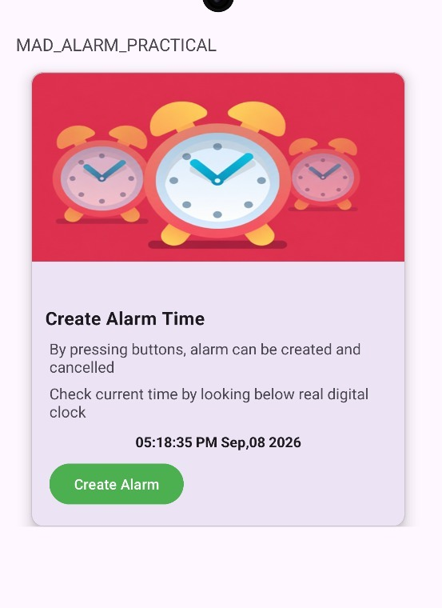
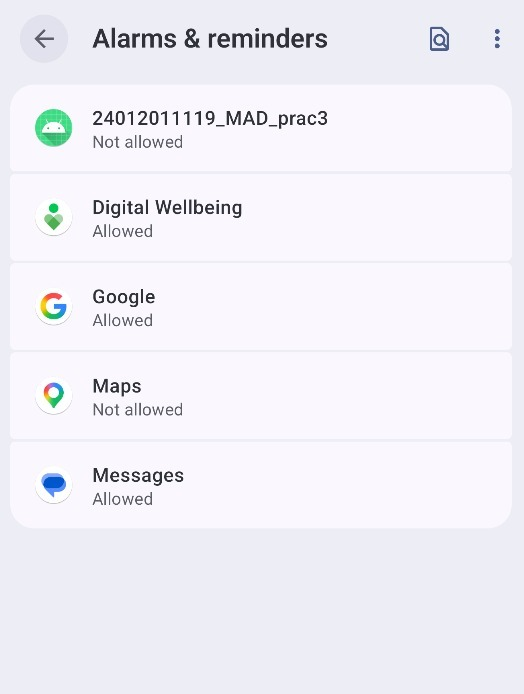
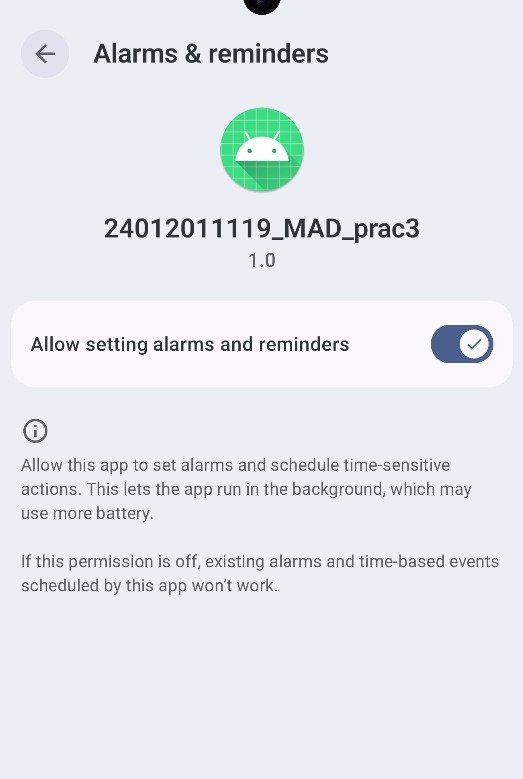
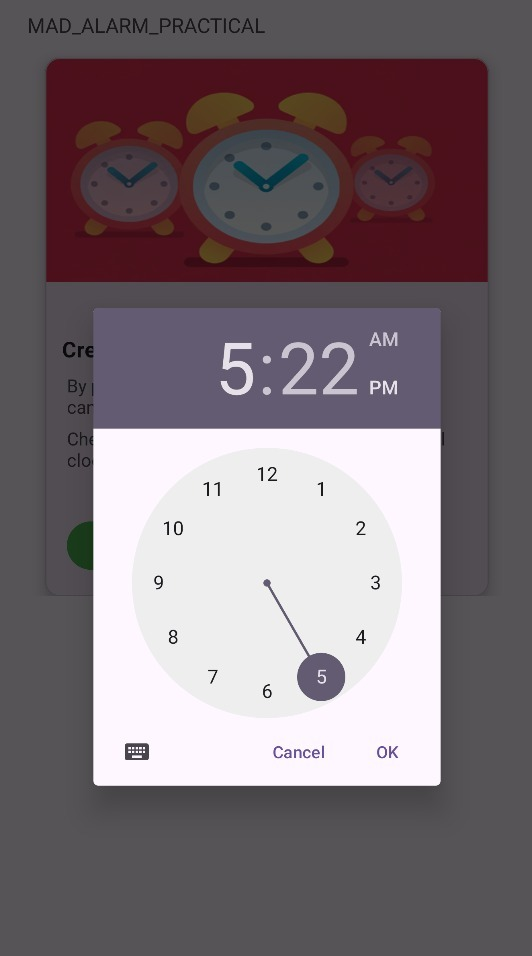
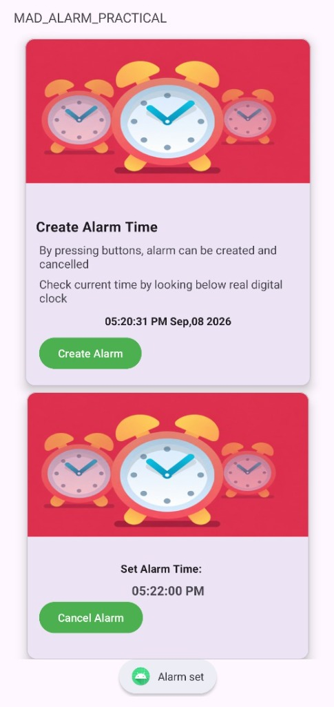

# Practical-4: Android Alarm Application

**Student Enrollment Number:** 24012011120  
**Course:** Mobile Application Development (MAD)  
**IDE:** Android Studio  

## Aim
Create an Android Alarm application using **Service** and **BroadcastReceiver**.

## Description
This practical demonstrates how to create an Android Alarm Application using **Service, BroadcastReceiver, and AlarmManager**. The application allows the user to select a specific time, create an alarm, and cancel the alarm when required.

## Features
- Display the current digital time.
- Create an alarm using TimePicker.
- Schedule an exact alarm using AlarmManager.
- Handle the alarm using BroadcastReceiver.
- Use Service for alarm-related operations.
- Request permission for setting alarms and reminders.
- Cancel the created alarm.

## Output

### 1. Home Screen

### 2. Alarm Permission List

### 3. Alarm Permission

### 4. Time Picker

### 5. Alarm Created

## Conclusion
Thus, an Android Alarm Application was successfully created using **Service, BroadcastReceiver, and AlarmManager** in Kotlin.
